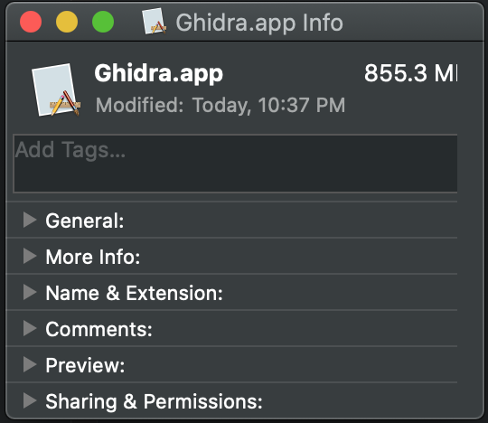
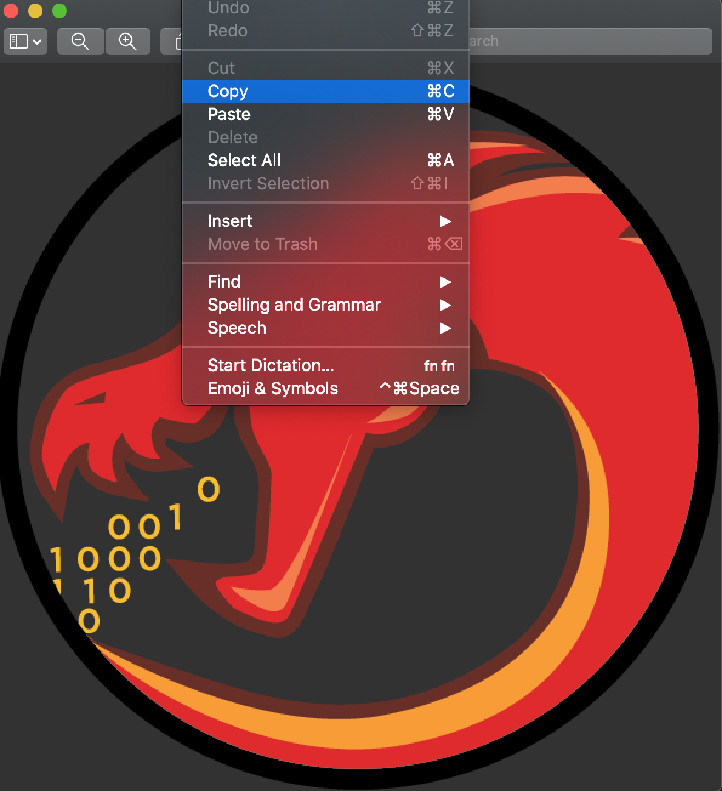
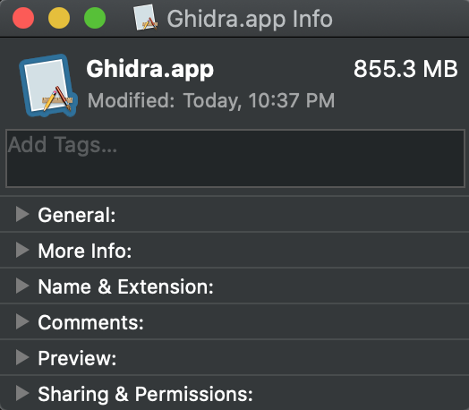
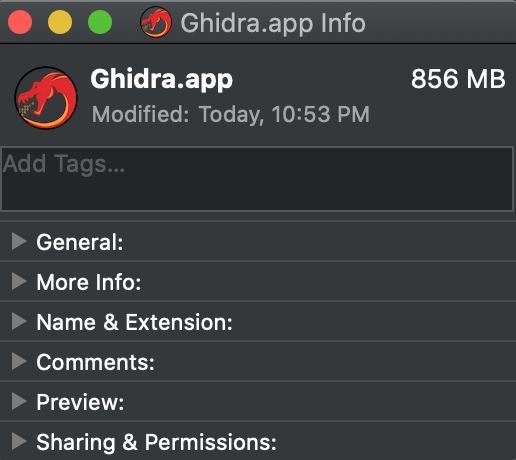

# How to add Ghidra to your Applications

## Mac OS

1. First be sure to download Ghidra from: https://ghidra-sre.org

2. After unzipping the archive, you'll be greeted by a folder with the following name

   - :file_folder: ghidra_x.x.x_PUBLIC (the x's represent the version number)

3. Move this folder from your Downloads folder to your Applications folder. Then navigate to that folder.

   ```bash
   Downloads$ mv ./ghidra_x.x.x_PUBLIC /Applications/
   Downloads$ cd /Applications
   ```

4. Here is where we have to start building the application bundle. We need to do this in order for the operating system to recognize this as an application. Run the following commands.

   ```bash
   Applications$ mkdir -p Ghidra.app/Contents/
   Applications$ mv ./ghidra_x.x.x_PUBLIC /Ghidra.app/Contents/
   Applications$ cd Ghidra.app/Contents/
   ```

5. Once inside, now rename the `ghidra_x.x.x_PUBLIC` directory to `Resources`. Make a new directory titled `MacOS` while inside Contents.

   ```bash
   Contents$ mv ./ghidra_x.x.x_PUBLIC ./Resources
   Contents$ mkdir MacOS
   ```

6. Now we need to move the `ghidraRun` shell script to the correct location and rename it in order for the operating system to recognize it. 

   ```bash
   Contents$ mv ./Resources/ghidraRun ./MacOS/Ghidra
   ```

7. Now I've included 3 files in this folder of my repository. Download these into your Downloads folder.

   - Info.plist
   - PkgInfo
   - Ghidra.png

8. Move these files to their respective locations:

   ```bash
   Contents$ mv ~/Downloads/Info.plist ~/Downloads/PkgInfo ./
   Contents$ mv ~/Downloads/Ghidra.png ./Resources
   ```

9. Now we need to edit the `Ghidra` shell script to be looking at the correct location. Do this with the editor of your choice. In `vim`, press `i` in order to enter Insert mode within the editor.

   ```bash
   Contents$ cd MacOS/
   MacOS$ vim Ghidra
   ```

   We need to change the line underneath `Launch Ghidra` to read the following since we moved it from its original location.

   ```bash
   # Launch Ghidra
   "${SCRIPT_DIR}"/../Resources/support/launch.sh bg Ghidra "${MAXMEM}" "" ghidra.GhidraRun "$@"
   ```

   Exit vim and save. `ESC + :wq`

10. Last step so that the app has a nice logo. User your file explorer to navigate to the Applications folder. Scroll to the Ghidra.app folder and `left click` on it. Select `Get Info`.

   

   - Keeping this `Get Info` window open, navigate within the file explorer to our Ghidra.png within the `Ghidra.app` folder. (to do this, `left-click` on `Ghidra.app` and select `Show Package Contents)

     

   - Navigate to the `Contents/Resources/` directory and double click on the `Ghidra.png` file you downloaded from this page. Using the preview app will work fine.

   - Once opened, click on the EDIT tab and click `copy` 

     

   - Now back at our `Get Info` window, click on the icon in the top left corner. Making sure that the icon is highlighted, click on the EDIT tab and click `paste` 

     

   - After you do this, your app should look like this:

     

Your Ghidra app should work now and will also show up with all your applications. You can now pin it to your dock along with your other frequently used applications.

> This does create a hidden file called `Info?` next to the Contents folder within the applications bundle. To my knowledge, this file is necessary for it to show as the image will go away if you delete it. 
>
> Please let me know if you know of a work around for this. All of my other Mac Applications don't have this hidden `Info?` file, so there must be a way for it to work but I don't know.

Also be aware that all bash shortcuts you have set now need to point to the new location of the shell script:

```bash
# within ~/.bashrc or ~/.zshrc
export PATH=/Applications/Ghidra.app/Contents/MacOS:$PATH
```

Now the command line call will be `Ghidra` instead of `ghidraRun`